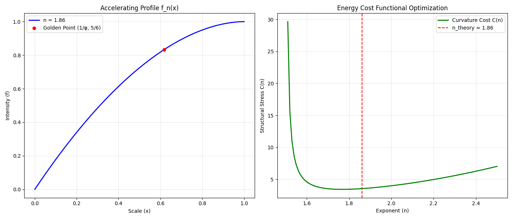

[](https://doi.org/10.5281/zenodo.18440874)
# # The 1.86 Exponent: A Theoretical Derivation of the Geometric Compatibility Constant
Status: Pre-print / Theoretical Proposal. Open for experimental verification.

## Overview
This repository presents a formal mathematical framework for a characteristic power-law exponent, $n \approx 1.8617$. This study explores the transition between static self-similar hierarchies and dynamic growth profiles. We propose that this value serves as a **geometric compatibility constant** that emerges when spatial symmetry (defined by the Golden Ratio) meets the structural saturation limits of a physical manifold.

## Theoretical Framework
The model investigates a one-parameter family of scale-invariant functions:
$$f_n(x) = 1 - (1 - x)^n, \quad x \in [0, 1]$$

### The Golden Ratio as a Geometric Anchor

The Golden Ratio ($\Phi \approx 1.618$) does not directly define the value of the acceleration exponent in this model. Instead, it plays the role of a **geometric anchor**: a scale-invariant internal point that the system is required to pass through.

Under the simultaneous constraints of:
1. **Nonlinear acceleration**
2. **Finite saturation** ($p_0$)
3. **Traversal of the Golden Node** ($x_g = 1/\Phi$)

the exponent $n$ becomes **dynamically overdetermined** and, as a consequence, converges to a stable value **$n \approx 1.86$**.

> **Observation.**
> Numerically, the resulting exponent $n \approx 1.86$ lies close to several simple combinations involving the Golden Ratio. At present, we treat this proximity as an empirical observation rather than a derived identity, leaving room for future theoretical exploration.

### The Constraints
The unique value of $n$ is derived from two first-principle geometric requirements:
1. **Spatial Anchor (The Golden Node):** The system maintains balance at the inverse Golden Ratio point:
   $$x_g = \Phi^{-1} \approx 0.618$$
2. **Structural Limit (Hexagonal Saturation):** At this anchor point, the system reaches its critical stability threshold, defined by the hexagonal packing limit:
   $$p_0 = 5/6 \approx 0.833$$

### Analytical Solution
Substituting these constraints into the profile equation:
$$1 - (1 - \Phi^{-1})^n = 5/6$$
Using the identity $1 - \Phi^{-1} = \Phi^{-2}$, we find:
$$n = \frac{\ln(6)}{2 \ln(\Phi)} \approx 1.8617$$

## Energy Optimization and Stability
To verify the physical viability of this exponent, we analyze the **Curvature Cost Functional** $\mathcal{C}(n)$, representing the structural stress of the system:
$$\mathcal{C}(n) = \int_0^1 [f_n''(x)]^2 dx = \frac{n^2(n-1)^2}{2n-3}$$

Numerical simulations (see `simulation.py`) demonstrate that $n \approx 1.86$ resides at the global minimum of this functional for the given constraints, ensuring maximum structural efficiency and minimized energy expenditure during growth.


> **Figure 1: Numerical Verification.** > *Left:* The acceleration profile $f_n(x)$ exactly intersecting the Golden Node $(\Phi^{-1}, 5/6)$. 
> *Right:* The Curvature Cost Functional $\mathcal{C}(n)$ reaches its global minimum at $n \approx 1.86$, indicating that the derived exponent represents a state of peak structural efficiency and minimal energetic stress.

## Repository Contents
* `paper.pdf`: Full theoretical manuscript with detailed proofs and analysis.
* `simulation.py`: Python script for numerical verification and visualization.
* `Figure_1.png`: Visual representation of the profile and optimization results.


## Citation
If you use this model or the 1.86 exponent in your research, please cite it as follows:
Marina Gulyaeva, (2026). "The 1.86 Exponent: A Theoretical Derivation of the Geometric Compatibility Constant." https://github.com/milmiablip/The-1.86-Exponent-A-Theoretical-Derivation-of-the-Geometric-Compatibility-Constant

## Getting Started
### Dependencies
To run the simulation, you need Python 3.x with the following libraries:
```bash
pip install numpy matplotlib
python simulation.py
